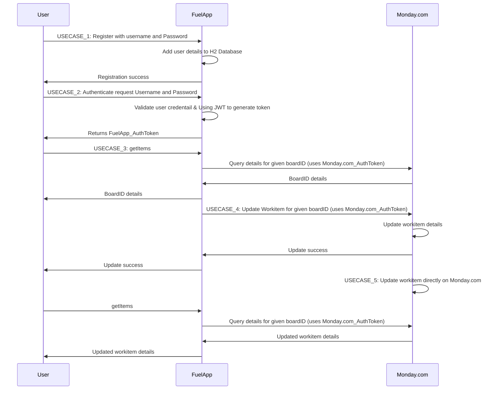

# FuelApp
Coding challenge

This application FuelApp interacts with Monday.com to retrieve and update work items/projects. FuelApp application is authenticated using JWT token.

**Pre-requisite:**
1.	Java 17 
2.	Spring boot 2.7.15
3.	H2 Database
4.	Postman 
5.	Test Account in Monday.com

**Cloning application source and run:**

Git Hub link: https://github.com/Vishnupriya-1/FuelApp.git

Command to run the application: ***mvn spring-boot:run***

On successful execution of application, below logs will appear in the console

> 2023-08-31 19:31:20.834  INFO 36448 --- [           main] o.s.b.w.embedded.tomcat.TomcatWebServer  : Tomcat started on port(s): 8081 (http) with context path ''
> 
> 2023-08-31 19:31:20.859  INFO 36448 --- [           main] com.test.fuelApp.FuelAppApplication      : Started FuelAppApplication in 5.617 seconds (JVM running for 6.024) 

**About the Service:**
The service uses an in-memory database (H2) to store the data. User can also use any database. After successful database setup, user can start using the REST endpoints defined in “com.test.fuelApp.controller”; on port 8081.

_Available endpoints:_

1.	POST: **_/register_** - to register the user by providing username and password as a request body. This will create a new user entry in the database.

> http://localhost:8081/register

> _Request:
> {
>    "username":"TestUser_1",
>    "password":"test123"
> }_

2.	POST: **_/authenticate_** - to authenticate the user by validating the given credential with data base and provides the authentication token to login.

> http://localhost:8081/authenticate

> _Request:
> {
>    "username":"TestUser_1",
>    "password":"test123"
> }_

3.	GET: **_/getItems_** - to retrieve the work items from Monday.com by passing the Monday account API token as a param and the request body which contains the query string as an input to call the API URL. Also pass the bearer token response received from the above endpoint.

> http://localhost:8081/getItems?token=<XXXXXXXXX>

> _Request:
> {
>    "query": "query { boards(ids:1259058835) { items { id name } } }"
> }_

4.	GET: **_/updateItemName_** - to update the item name in Monday.com by passing the Monday account API token as a param and the request body which contains the query string as an input to call the API URL. Also pass the bearer token response received from the above endpoint.

> http://localhost:8081/updateItemName?token=<XXXXXX>

> _Request:
> {
>    "query": "mutation {change_multiple_column_values(item_id:1259058839, board_id:1259058835, column_values: \"{\\\"name\\\" : \\\"Completed Item\\\"}\") {id}}" 
> }_

**To view H2 in-memory database:**

Application runs on H2 in-memory database. To view and query the database you can browse to http://localhost:8081/h2-console. 
Default username is 'sa' with password as 'password'.

**High Level Flow Diagram**

